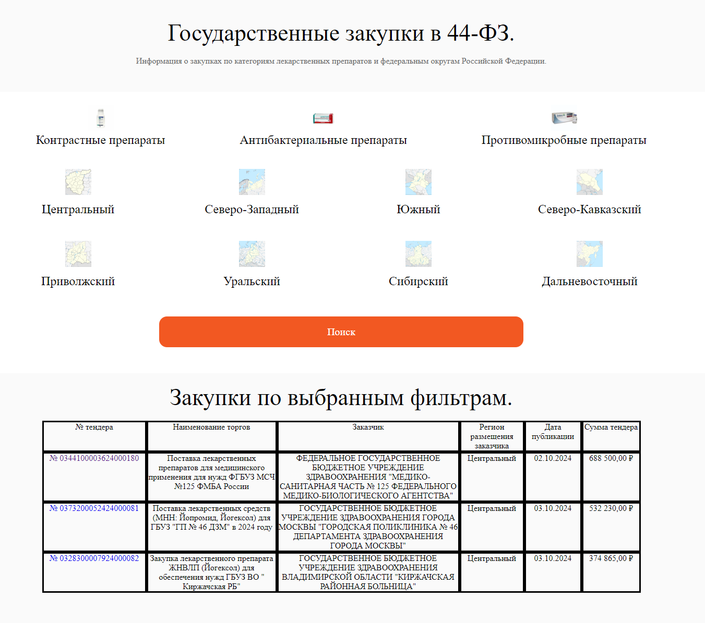
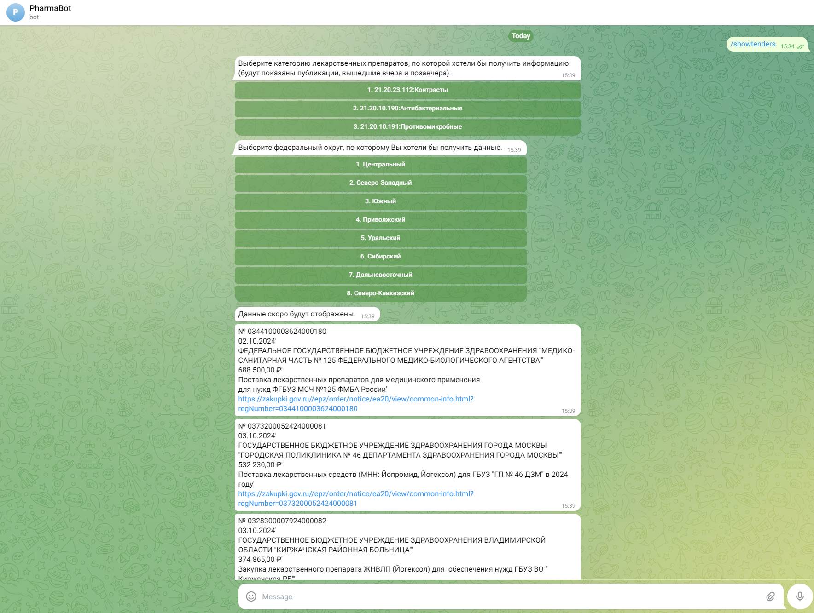

# Дипломный проект
Разработка приложения по автоматизированному сбору, хранению, выводу для пользователей информации о тендерных закупках лекарственных препаратов в сегменте ФЗ-44 с использованием Fetch API и Telegram API в качестве средств UI.

## Задачи приложения
* Парсер (Python) - сбор данных о новых закупках лекарственных препаратов по категориям:
    * "21.20.23.112: Вещества контрастные",
    * "21.20.10.190: Препараты противомикробные для системного использования",
    * "21.20.10.191: Препараты антибактериальные для системного использования"
* Веб-интерфейс (HTML, CSS, JavaScript, Java Spring) - страница с динамическим отображением данных на основе фильтров
* Бот (Java) - бот для отображения данных, исполняющий команды пользователей

## Масштабирование
Приложение может быть дополнено любым количеством категорий лекарственных препаратов. 

## Технологический стэк
* Базы данных: sqllite3
* Библиотеки/зависимости: 
    1. Python – beautifulsoup4, requests, sqllite3; 
    2. Java – TelegramBots API; JPA Hibernate sqllite3; Spring Boot, Spring Security;
    3. HTML, CSS, JavaScript – Fetch API
* Контроль версий: GitHub

## Скриншоты приложения

## Запуск приложения
### 1. git clone:
1. Скачать приложение к себе на локальный репозиторий с использованием команды git clone: 

        git clone https://github.com/AlexServGE/PharmaViewerBot.git
        
    Перейти в корневую директорию проекта:

        cd PharmaViewerBot/
### 2. Настройка telegram-бота:
1. С использование BotFather зарегистрировать бот и получить токен. Инструкция по регистрации бота: 

        https://marketolog.mts.ru/blog/kak-sozdat-bota-v-botfather-gaid-dlya-novichkov 
2. Перейти в директорию проекта: <b>PharmaViewerBot/BotSqlJava/ </b>. 

        cd BotSqlJava/
3. Создать файл <b>BotToken.txt</b> в директории <b>PharmaViewerBot/BotSqlJava/ </b> (название файла и расширение файла должны строго соответствовать указанному)

        touch BotToken.txt
4. Вставить полученный от BotFather токен (без добавления дополнительных символов) в <b>BotToken.txt</b>

        echo <token> > BotToken.txt
### 3. Docker Compose:
1. Перейти в корневую директорию проекта <b>PharmaViewerBot/ </b>, где расположен файл <b>docker-compose.yml</b>

        cd ..
2. Развернуть приложение с использованием команды:
        
        docker-compose up

## После запуска
* <b>Парсер</b> и <b>Telegram-бот</b> запустятся одновременно.
В консоли появится сообщение:
        
        bot_container     | SLF4J(W): No SLF4J providers were found.
        bot_container     | SLF4J(W): Defaulting to no-operation (NOP) logger implementation
        bot_container     | SLF4J(W): See https://www.slf4j.org/codes.html#noProviders for further details.
        backspring_container  |
        backspring_container  |   .   ____          _            __ _ _
        backspring_container  |  /\\ / ___'_ __ _ _(_)_ __  __ _ \ \ \ \
        backspring_container  | ( ( )\___ | '_ | '_| | '_ \/ _` | \ \ \ \
        backspring_container  |  \\/  ___)| |_)| | | | | || (_| |  ) ) ) )
        backspring_container  |   '  |____| .__|_| |_|_| |_\__, | / / / /
        backspring_container  |  =========|_|==============|___/=/_/_/_/
        backspring_container  |  :: Spring Boot ::                (v2.4.0)

* Необходимо дождаться пока <b>Парсер</b> не вернёт сообщение в командной строке (ожидание в среднем составляет от 8 до 15 минут [время ожидания неограничено, так как зависит от количества данных для парсинга]): 

        parser_container  | Начало сбора - ####-##-## ##:##:##.######
        parser_container  | Connection is established: Database is created in memory
        parser_container  | Connection is established: Database is created in memory
        parser_container  | Connection is established: Database is created in memory
        parser_container  | Окончание сбора - ####-##-## ##:##:##.######. Длительность - #:##:##.######
        parser_container exited with code 0

* После этого можно открыть созданный <b>Telegram-бот</b> в приложении Telegram. Нажать кнопку "Запустить", либо набрать в текстовом поле команду в виде сообщения "/start" и начать работу в приложении.
* После можно перейти в папку Frontend в корневой директории проекта и открыть файл index.html. Откроется страница с фильтрами и собранными данными.

## Планировщик Crontab
Crontab является встроенной утилитой ОС Lunix, которая позволяет настраивать автоматическое регулирование процессов, запущенных под одной оболочкой (операционной системой).  
Для данного проекта можно воспользоваться Crontab для следующих целей:
* Автоматический запуск <b>Парсера</b> на ежедневной основе
* Автоматическое удаление базы данных sqllite3 на еженедельной основе (чтобы исключить риск переполнения памяти жесткого диска)

### Настройки планировщика Crontab:
1. Открываем планировщик Crontab командой:
    
        sudo crontab -e
2. Настраиваем автоматический запуск <b>Парсера</b>. Раз в день - вторник - суббота, в 00:10 (время Московское):

        10  0  *  *  2-6 docker start parser_container

3. Настраиваем автоматическое удаление <b>Базы данных</b>. Раз в неделю - по субботам, в 00:01 (время Московское):

        1  0  *  *  6 rm <path>/ProcurementsDB/Procurements.db